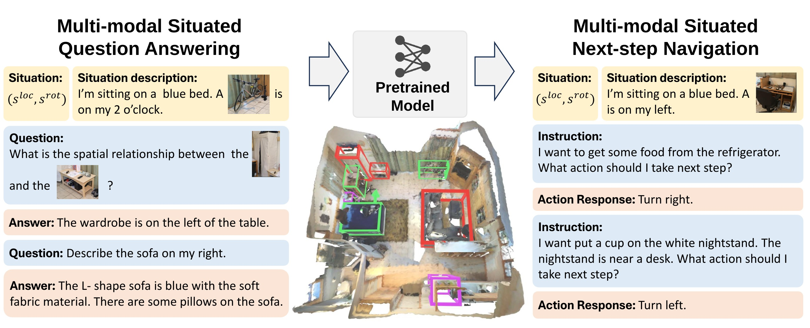
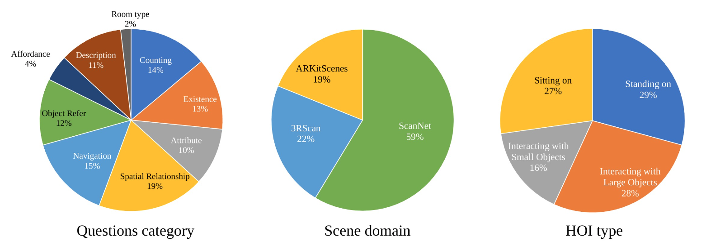
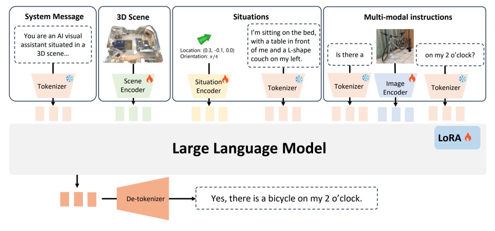

<h2 align="center">
  <span></span><b> Multi-modal Situated Reasoning in 3D Scenes</b>
</h2>

<div align="center" margin-bottom="6em">
<a target="_blank" rel="external nofollow noopener" href="https://xiongkunlinghu.github.io/">Xiongkun Linghu<sup>✶</sup></a>,
<a target="_blank" rel="external nofollow noopener" href="https://huangjy-pku.github.io/">Jiangyong Huang<sup>✶</sup></a>,
<a target="_blank" rel="external nofollow noopener" href="https://nxsedson.github.io/">Xuesong Niu<sup>✶</sup></a>,
<a target="_blank" rel="external nofollow noopener" href="https://jeasinema.github.io/">Xiaojian Ma</a>,
<a target="_blank" rel="external nofollow noopener" href="https://buzz-beater.github.io/">Baoxiong Jia</a>,
<a target="_blank" rel="external nofollow noopener" href="https://siyuanhuang.com/">Siyuan Huang</a>
</div>
&nbsp;

<div align="center">
    <a href="https://arxiv.org/abs/2409.02389" target="_blank" rel="external nofollow noopener">
    </a>
    <a href="https://msr3d.github.io/" target="_blank" rel="external nofollow noopener">
    </a>
    <a href="https://docs.google.com/forms/d/e/1FAIpQLSdzj25kXcthCKtypAI0wQP8j16e9F7ODBroL4SCH_ly8_3rKw/viewform?usp=sf_link" rel="external nofollow noopener" target="_blank">
    </a>
</div>
&nbsp;

<div align="middle">

</div>

### Data Distribution
MSQA includes 251K situated question-answering pairs across 9 distinct question categories, covering complex scenarios within 3D scenes.
<div align="middle">

</div>

### Model
MSR3D accepts 3D point cloud, text-image interleaved situation, location, orientation, and question as multi-modal input. It has a stronger situation modeling capability than LEO.
<div align="middle">

</div>

## 📋 Contents

1. [Introduction](#-introduction)
2. [News](#-news)
3. [TODO List](#📝-todo-list)
4. [Citation](#🔗-citation)
5. [License](#💼-license)
6. [Acknowledgements](#🪧-acknowledgements)

## 📖 Introduction
Situation awareness is essential for understanding and reasoning about 3D scenes in embodied AI agents. However, existing datasets and benchmarks for situated understanding suffer from severe limitations in data modality, scope, diversity, and scale.

To address these limitations, we propose <b>Multi-modal Situated Question Answering (MSQA), a large-scale multi-modal situated reasoning dataset, scalably collected leveraging 3D scene graphs and vision-language models (VLMs) across a diverse range of real-world 3D scenes</b>. MSQA includes <b>251K situated question-answering pairs across 9 distinct question categories, covering complex scenarios within 3D scenes</b>. We introduce a novel interleaved multi-modal input setting in our benchmark to provide both <b>texts, images, and point clouds for situation and question description</b>, aiming to resolve ambiguity in describing situations with single-modality inputs (e.g., texts).


Additionally, we devise the <b>Multi-modal Next-step Navigation (MSNN) benchmark to evaluate models' grounding of actions and transitions between situations</b>. Comprehensive evaluations on reasoning and navigation tasks highlight the limitations of existing vision-language models and underscore the importance of handling multi-modal interleaved inputs and situation modeling. Experiments on data scaling and cross-domain transfer further demonstrate <b>the effectiveness of leveraging MSQA as a pre-training dataset for developing more powerful situated reasoning models</b>, contributing to advancements in 3D scene understanding for embodied AI.

## 🔥 News
- \[2025-2\] We release MSR3D_v2 data, training code. This version of data remove some ambiguity in questions and answers.
- \[2025-2\] We provide the script to visualize the MSQA/MSNN data, including the situaitions.
- \[2024-10\] We released the dataset, which has been structured to facilitate the evaluation of multimodal large language models (MLLMs).
- \[2024-9\] 🎉 Our paper is accepted by NeurIPS 2024 Datasets and Benchmarks Track!
- \[2024-9\] We released the [paper](./asset/MSR3D.pdf) of MSR3D. Please check the [webpage](https://msr3d.github.io/).

## 💡 Get started
1. Clone Github repo.
```shell
git clone https://github.com/MSR3D/MSR3D.git
```

2. Create `conda` environment and install dependencies.
```shell
conda create -n msr3d python=3.9
conda activate msr3d

# install PyTorch, take our version for example
conda install pytorch==1.12.1 torchvision==0.13.1 torchaudio==0.12.1 cudatoolkit=11.3 -c pytorch

# install other dependencies with pip
pip install -r requirements.txt

# install peft separately to escape its install_requires
pip install peft==0.5.0 --no-deps
```

3. Install third party libraries (for point cloud backbones). Note that if the installation of `PointNext` fails, you can either 1) comment the line of importing `PointNext` in `model/pcd_backbone.py` or 2) download the [compiled file](https://huggingface.co/datasets/huangjy-pku/LEO_data/blob/main/pointnet2_batch_cuda.cpython-39-x86_64-linux-gnu.so) and place it at `model/pointnext/cpp/pointnet2_batch/`, which may possibly help.

```shell
cd model

# default PointNet++
cd pointnetpp
python setup.py install
cd ..

# optional: PointNext (if you want to substitute the default PointNet++)
cd pointnext/cpp/pointnet2_batch
python setup.py build_ext --inplace
cd ../../../

cd ..
# sanity check
python -c 'from model.pointnetpp.pointnetpp import PointNetPP'
# for PointNext, run 'from model.pointnext.pointnext import PointNext'
```

## 🚀 Get Started

1. Clone Github repo.
```shell
git clone git@github.com:embodied-generalist/embodied-generalist.git
cd embodied-generalist
```

2. Create `conda` environment and install dependencies.
```shell
conda create -n leo python=3.9
conda activate leo

# install PyTorch, take our version for example
conda install pytorch==1.12.1 torchvision==0.13.1 torchaudio==0.12.1 cudatoolkit=11.3 -c pytorch

# install other dependencies with pip
pip install -r requirements.txt

# install peft separately to escape its install_requires
pip install peft==0.5.0 --no-deps
```

3. Install third party libraries (for point cloud backbones). Note that if the installation of `PointNext` fails, you can either 1) comment the line of importing `PointNext` in `model/pcd_backbone.py` or 2) download the [compiled file](https://huggingface.co/datasets/huangjy-pku/LEO_data/blob/main/pointnet2_batch_cuda.cpython-39-x86_64-linux-gnu.so) and place it at `model/pointnext/cpp/pointnet2_batch/`, which may possibly help.

```shell
cd model

# default PointNet++
cd pointnetpp
python setup.py install
cd ..

# optional: PointNext (if you want to substitute the default PointNet++)
cd pointnext/cpp/pointnet2_batch
python setup.py build_ext --inplace
cd ../../../

cd ..
# sanity check
python -c 'from model.pointnetpp.pointnetpp import PointNetPP'
# for PointNext, run 'from model.pointnext.pointnext import PointNext'
```

## 📁 Prepare data
- **Scand data.** MSR3D takes object centric point cloud as input. You can find the point cloud files in the *pcds* directory. You should unzip the point cloud files to the directories `${scan_family_base}`, `${rscan_base}` and `${ARkit_base}`.


### Scan data structure

```
├── ${scan_family_base}   # scannet
    ├── scan_data
    |     ├── pcd_with_global_alignment
    |     |     └── ${scan_id}.pth
    |     └── instance_id_to_label
    |           └── ${scan_id}_inst_to_label.pth
    └── annotations/splits/scannetv2_'+ split + "_sort.json"   # for MSNN split


├── ${rscan_base}
    └── 3RScan-ours-align
        ├── ${scan_id}
            ├── pcds.pth
            └── inst_to_label.pth

├── ${ARkit_base}
    └── scan_data
        ├── pcd-align
        |  └──${scan_id}.pth
        └── instance_id_to_label
              └── ${scan_id}_inst_to_label.pth

```

- **Object images.** We provide the object images in the *obj_imgs* directory. The images of objects are stored in a certain directory and will replace the placeholders. Since the corresponding files of raw rgb images are very large (> 500G per dataset), we provide only one image for each object. If you have such files and want to sample images in the training stage, we also provide an implementation for object image sampling in the dataloader. You should unzip the images to the directories `${obj_img_base}`.

```
# object images data structure

├── ${obj_img_base}
        ├── ScanNet
        ├── 3RScan
        └── ARkit
```

- **Object image sampling.** Add `'mv_info'` to `data_type_list` and add corresponding rgb images in the `${scan_family_base}`, `${rscan_base}` and `${ARkit_base}` to enable image sampling.
```
one_bbox = random.choice(scan_data['mv_info'][int(inst_id)])
img_sample = self.scan_data_loader.get_one_img(one_bbox)
```

- **Text annotations.** Put the text annotations in the directory `'msr3d_base'`.
```
# object images data structure

├── ${msr3d_base}
        ├── scannet
        |     └── msqa_scannet_{split}.json
        ├── rscan
              └── msqa_rscan_{split}.json
        └── arkitscenes
              └── msqa_arkitscenes_{split}.json

├── ${msnn_base}
      └── scannet
            └── msnn_scannet.json

```

## 📝 TODO List

- [x] Test set, with ground truth multi-view images, object locations and attributes
- [x] full dataset
- [x] Evaluation code
- [x] Training code
- [x] Offline evaluator

## 🔗 Citation

If you find our work helpful, please cite:
```bibtex
@article{linghu2024multi,
  title={Multi-modal Situated Reasoning in 3D Scenes},
  author={Linghu, Xiongkun and Huang, Jiangyong and Niu, Xuesong and Ma, Xiaojian and Jia, Baoxiong and Huang, Siyuan},
  journal={Advances in Neural Information Processing Systems},
  year={2024}
}
```

## 💼 License

<a rel="license" href="http://creativecommons.org/licenses/by-nc-sa/4.0/"></a>

This work is under the <a rel="license" href="http://creativecommons.org/licenses/by-nc-sa/4.0/">Creative Commons Attribution-NonCommercial-ShareAlike 4.0 International License</a>.

## 🪧 Acknowledgements
- [LEO](https://embodied-generalist.github.io/): Our baseline model is built upon LEO.
- [SQA3D](https://sqa3d.github.io/): SQA3D is a situated question-answering dataset based on ScanNet.
